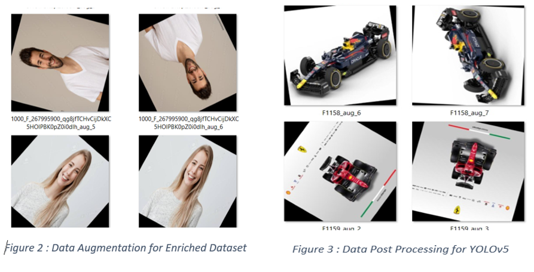

# SyncLab : Intelligent Image Dataset Generation System

## Introduction
Creating diverse test data for vision AI is challenging. Traditional methods involve manual website scanning, prone to biases. Existing datasets often lack specificity, restrictions on the number of images, and might face copyright issues. Our project proposes an NLP-driven solution to revolutionize dataset creation, particularly for emotion detection.

## Scope of Project
1. **Query Expansion:** Enhancing search queries for accuracy.
2. **Image Scraping:** Automated methods for data retrieval.
3. **Model Assessment:** Evaluating dataset quality using complex models.
4. **Data Augmentation:** Enhancing dataset diversity through augmentation.

## Methodology
Addressing the challenge of laborious and time-consuming creation of test data for various vision AI solutions, this project aims to streamline the process through innovative methodologies. The primary focus is on enhancing efficiency and effectiveness in web scraping and image extraction, while also optimizing dataset quality for diverse use cases.

1. **Query Expansion Techniques:** Leveraging NLP models, we expand queries to retrieve a broader spectrum of keywords, facilitating comprehensive internet image searches and enhancing dataset richness.

2. **Image Scraper Methods:** Employing automated solutions via Selenium, Google, and Flicker API, we automate image dataset creation, ensuring adherence to specific requirements, thus eliminating manual labor and enhancing efficiency.

3. **Complex Model Assessment for Dataset Validation:** Employing a sophisticated Emotion Detection model founded on Complex Computer Vision and AI, we rigorously evaluate dataset quality, emphasizing precision and diversity for optimal model performance.

4. **Data Augmentation:** Implementing image augmentation techniques such as rotation, flipping, and scaling, we diversify and enrich the quality of the dataset, improving model robustness and performance.

This methodology ensures efficient, accurate, and diverse creation of test data for vision AI solutions, addressing the challenges posed by manual labor and generic search engines.

## Results
The culmination of the project yields a comprehensive and diverse dataset, tailored specifically for various deep learning and AI endeavors, emphasizing object-centricity and richness in data representation.
Our generated datasets demonstrate superior performance in terms of accuracy percentages compared to existing online datasets. Through rigorous testing for emotion detection and YOLOv5 detection, our solution consistently outperforms competitors, yielding higher accuracy rates. This improvement translates to better accuracy in AI models and projects.

## Conclusion
Our project represents a significant leap forward in AI, particularly in computer vision and emotion detection. Leveraging NLP for query expansion and automating dataset creation via web scraping, we've addressed the critical need for diverse, high-quality datasets. This streamlined approach ensures adherence to requirements, enhancing accuracy. Through image augmentation, we've bolstered dataset richness and model robustness. Future work involves updating Selenium web scraping scripts to adapt to changes in HTML structures and considering advancements in search engine behavior, potentially eliminating the need for noise-checking code. This work lays groundwork for innovation, promising real-world impact and pushing AI boundaries.

## References
1. Dikmans, B., & Kang, D. (2023). A Brief Survey into the Field of Automatic Image Dataset Generation through Web Scraping and Query Expansion.
2. Niu, Qingli, et al. "Web Scraping Tool For Newspapers And Images Data Using Jsonify." Journal of Applied Science and Engineering 26.4 (2022): 465-474.
